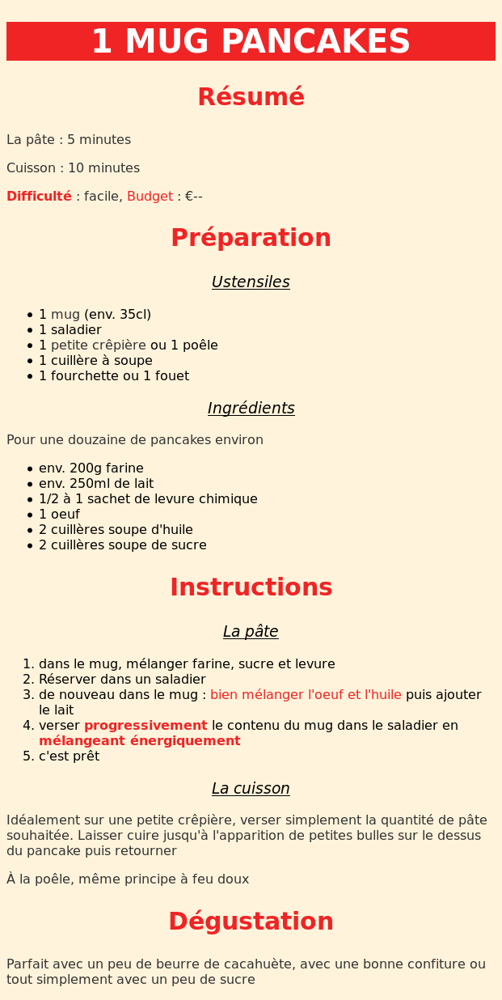
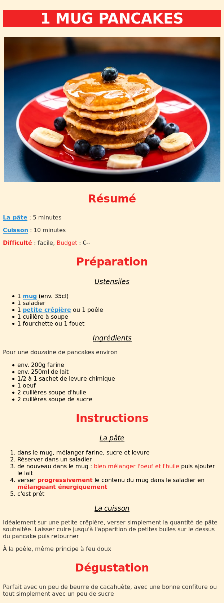
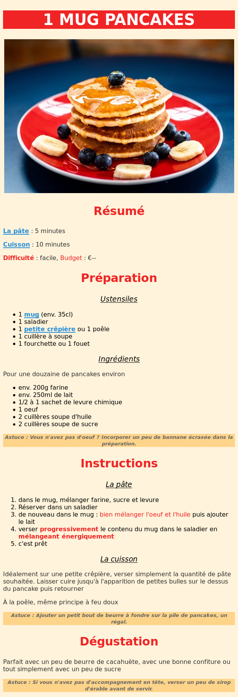

# EXERCICE HTML - CSS

# Recette de pancakes

Bon on va pas se mentir, les pancakes c'est bon.

Mais faire du HTML et CSS c'est aussi beaucoup de plaisir.

Alors... Pourquoi choisir ? 

## Objectif

Réaliser l'intégration de la recette des "1 mug pancackes" :



> Recette testée et approuvée :yum:

## Instructions

Beaucoup de textes quand même... Je vous rassure tout de suite, les textes sont fournis :relaxed: dans le fichier `ressources/recette.txt`

- Commencez par créer une page html avec la structure de base.
- Ajoutez les contenus en faisant le balisage.
- Quand toute la structure (le fond) est ok, passez aux styles css
- Allez-y doucement

## Charte

- La font (police de caractères) est sans empatement : `sans-serif`
- La couleur de fond est `#fff3db`
- Les titres et autres éléments importants utilisent : `#f02425`
- Le titre principal est en blanc


## Bravo

Si vous avez réussi à terminer cette intégration :clap: félicitations, vous pouvez aller vous reposer sereinement. :+1:

Si il vous reste encore un peu d'énergie, je vous propose de tester cette recette :wink:

---


Vous en voulez plus ? 

Attention, c'est du facultatif, le challenge est **fini**.

<details>
<summary>Bonus : <strong>facultatif</strong></summary>

## Bonus

- Ajoutez le visuel `https://images.unsplash.com/photo-1528207776546-365bb710ee93?fit=crop&w=600` à l'intégration : [MDN - img](https://developer.mozilla.org/fr/docs/Web/HTML/Element/Img) ou [htmlreference - img](https://htmlreference.io/element/img/)
- Ajoutez des liens dans la page, par exemple vers une boutique pour une crêpière ou un mug : : [MDN - a](https://developer.mozilla.org/fr/docs/Web/HTML/Element/a) ou [htmlreference - a](https://htmlreference.io/element/a/)



</details>

---

Encore ? Euh il va falloir penser à aller se reposer là.

<details>
<summary>Méga bonus : <strong>encore plus facultatif</strong></summary>

## Méga Bonus

- Ajoutez les textes suivants à l'intégration.

```
Astuce : Vous n'avez pas d'oeuf ? Incorporer un peu de bannane écrasée dans la préparation.

Astuce : Ajouter un petit bout de beurre à fondre sur la pile de pancakes, un régal.

Astuce : Si vous n'avez pas d'accompagnement en tête, verser un peu de sirop d'érable avant de servir.
```

- Pour styliser les textes correctement et/ou facilement il faudra faire appel à des petites nouveautés : [MDN - class](https://developer.mozilla.org/fr/docs/Web/HTML/Attributs_universels/class)




</details>
